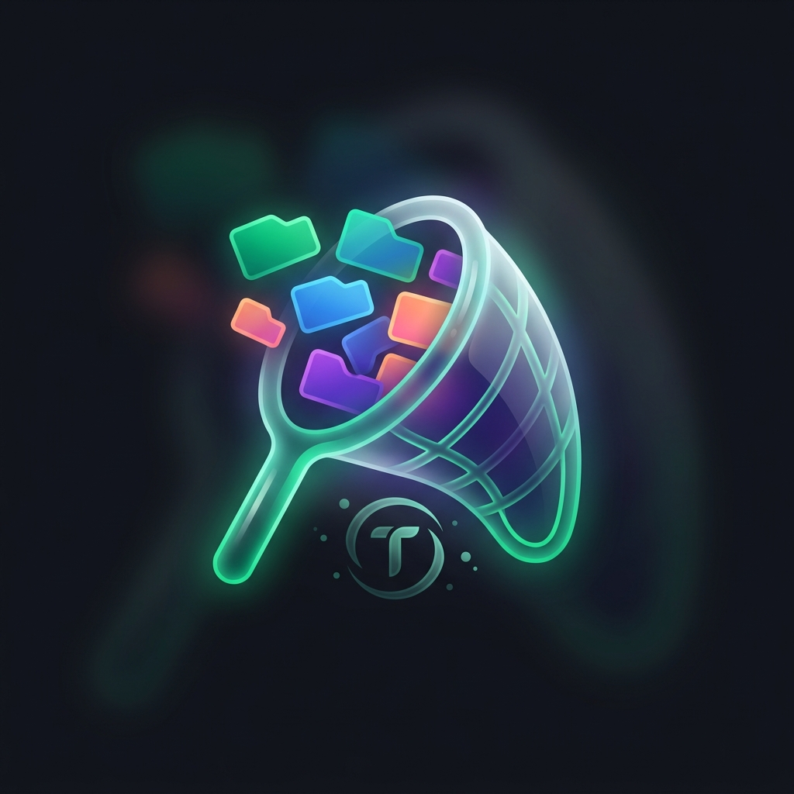

# Tab Catcher & Session Manager

A powerful Firefox extension designed to streamline your research workflow by capturing, consolidating, and managing browser tabs with AI-powered summarization and automated backup capabilities.

## 🚀 Key Features

- **One-Click Capture**: Instantly captures all open tabs across your browser and closes them to declutter your workspace.
- **AI-Powered Summarization**: Uses **Gemini 1.5 Flash** to generate concise, 2-3 word summaries of your tab sessions.
- **Daily Consolidation**: Automatically merges multiple captures from the same day into a single, organized "Session List."
- **Smart Deduplication**: Intelligently removes duplicate URLs within your daily records, ensuring a clean history library.
- **Automated JSON Backups**: Every capture triggers an automatic JSON export to your local storage for data sovereignty.
- **Omnivore Folder Import**: Easily restore your entire history by pointing the extension to a folder containing your backup JS files.
- **Full Library Manager**: A dedicated full-page interface for managing your history, reopening sets of tabs, and performing manual database exports.

Demo
## Demo (Click below thumbnail)

## 🛠️ Installation (Developer Mode)

1. **Clone/Download** this repository.
2. Open **Firefox** and navigate to `about:debugging`.
3. Click on **"This Firefox"** in the left sidebar.
4. Click **"Load Temporary Add-on..."**.
5. Select the `manifest.json` file from the `Launch_Tab` folder.

## ⚙️ Configuration

To enable AI summarization, you must provide a Google Gemini API Key:
1. Create a `.env` file in the root directory (or use the existing one).
2. Add your key: `GEMINI_API_KEY=your_key_here`.

## 📂 Project Structure

- `manifest.json`: Extension metadata and permissions.
- `popup.html/js`: The primary interface for quick captures and list viewing.
- `manager.html/js`: The advanced interface for folder imports and bulk exports.
- `gemini.js`: Integration with Google Gemini AI for session summarization.
- `styles.css`: Modern, dark-themed UI with glassmorphic elements.
- `url_session_data/`: (Recommended) Default folder for storing your JSON session exports.

## 🔒 Permissions Used

- `tabs`: To read and manage open browser tabs.
- `storage`: To locally persist your session history.
- `unlimitedStorage`: To handle large history databases.
- `downloads`: To automate the JSON backup process.

