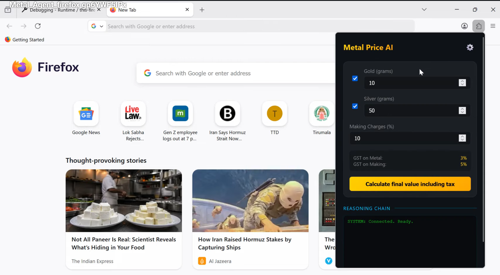

# Metal Price Agent (Firefox Extension)

Metal Price Agent is an agentic AI-powered Firefox extension and Python tool that calculates the final purchase cost of gold and silver in India. It considers live market prices from Yahoo Finance, real-time USD to INR exchange rates, making charges, and the specific Indian GST structure (3% on metal, 5% on making charges).

## Project Description

Calculating the final price of precious metals in India is complex due to fluctuating global prices, exchange rates, and multi-layered taxes. This project provides a robust, automated solution using a "Reasoning Loop" (Agentic AI) to:

- Fetch live Gold (`GC=F`) and Silver (`SI=F`) prices in USD/oz.
- Fetch real-time USD/INR exchange rates.
- Apply user-defined Making Charges (%).
- Calculate a full GST breakdown (3% on metal value, 5% on making charges).
- Display a transparent "Reasoning Chain" showing exactly how the AI arrived at the final figure.

## Key Features

- **Agentic AI Loop**: Implements a Thought → Tool Call → Result → Answer cycle, allowing the model to perform multi-step financial research.
- **Live Market Data**: Directly integrates with Yahoo Finance for current global futures prices.
- **GST Accuracy**: Precisely follows Indian tax regulations for physical gold/silver purchases.
- **Metal Selection**: Toggle between Gold, Silver, or both for combined calculation.
- **Security**: Securely stores your Gemini API key in local browser storage; key is never sent to any third party.
- **Modern UI**: Features a sleek, dark-themed "Glassmorphism" design with smooth micro-animations.
- **Standalone Agent**: Includes `metal_price.py` for terminal-based use with the same agentic logic.

## How It Works

The extension uses the **Gemini 3.1 Flash** model to drive a step-by-step reasoning process:

1. **User Query**: The user provides weights (e.g., 10g Gold) and a making charge %.
2. **Thought**: The Agent decides it needs live prices first.
3. **Tool Call**: It calls `get_metal_price` and `get_usd_to_inr` tools via Javascript `fetch`.
4. **Tool Result**: The data (symbol and price) is returned to the Agent.
5. **Logic**: The Agent determines all values are present and calls `calculate_gst_breakdown`.
6. **Final Answer**: The Agent formats a human-readable response with the total cost and tax breakdown.

Demo
## Demo (Click below thumbnail)

## LLM Logs
[Click here for LLM Logs](https://github.com/haricharanvihari/extensive_ag/blob/main/S3_AG/LLM_Logs.md)

## Installation (Developer / Local)

1. Open Firefox and go to `about:debugging#/runtime/this-firefox`.
2. Click **Load Temporary Add-on**.
3. Select the **`manifest.json`** file from the `Metal_Price` root folder.
4. Pin the "Metal Price AI Agent" (Gold icon style) to your Firefox toolbar.

## Usage Guide

1. Click the extension icon to open the popup.
2. Click the **Gear (⚙️)** icon to open the settings:
   - Enter your **Gemini API Key**.
   - Click **Save settings**.
3. In the main panel:
   - Use the **Checkboxes** to select Gold or Silver.
   - Enter the weight in **grams**.
   - Adjust the **Making Charges %** (default is 10%).
4. Click **Calculate final value including tax**.
5. Watch the **Reasoning Chain** as the agent fetches data and computes the total.

## Permissions Used

- `storage`: Persists your API key securely within your browser profile.
- `host_permissions`: Allows the extension to safely fetch live financial data from `finance.yahoo.com` and communicate with Google's Generative AI API.

## Data and Privacy

- **Local Storage**: Your API key and calculation inputs are stored only on your device.
- **Direct Connection**: The extension connects directly to Google Gemini and Yahoo Finance; no middle-man servers are used.
- **No Tracking**: No usage data or browsing history is tracked or collected.

## Repository Structure

- `manifest.json`: Extension metadata and security permissions.
- `popup.html`: The modern UI layout for the calculator.
- `agent.js`: The "brain" of the extension containing the agentic loop and tool definitions.
- `popup.css`: The "Glassmorphism" styling and animations.
- `metal_price.py`: Standalone Python version of the agent for CLI use.
- `.env`: (Local) Configuration for the Python agent.
